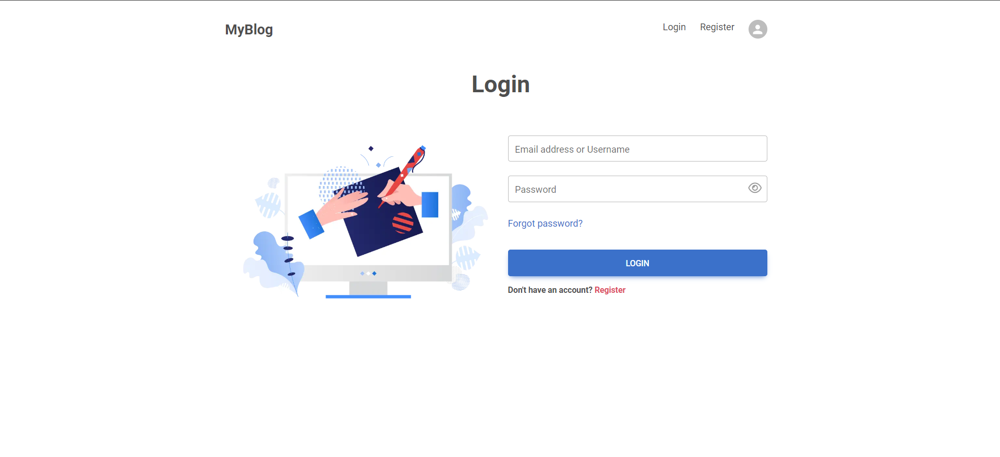
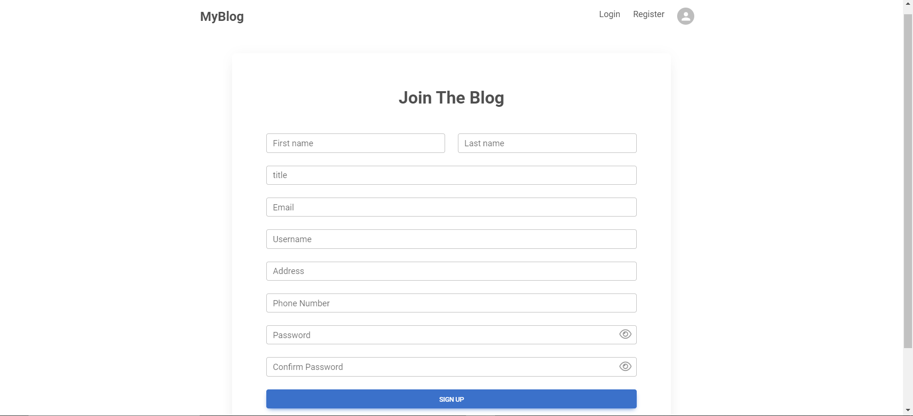
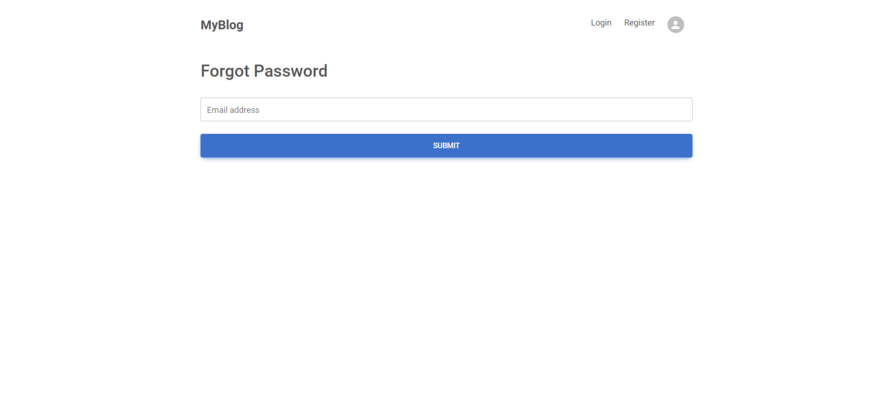
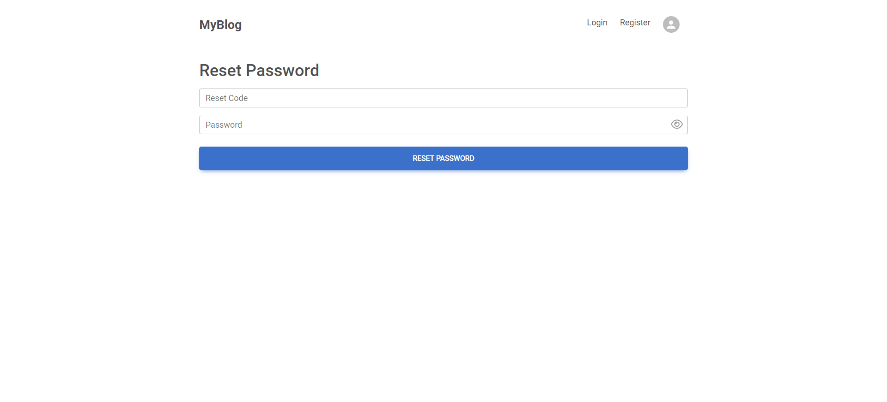
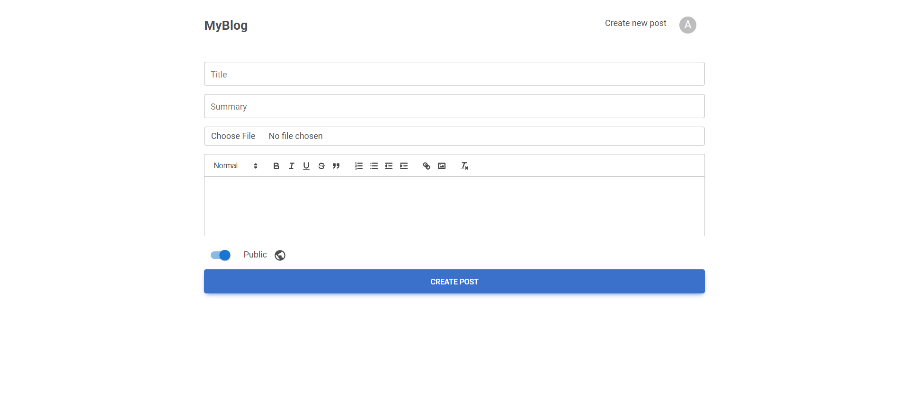
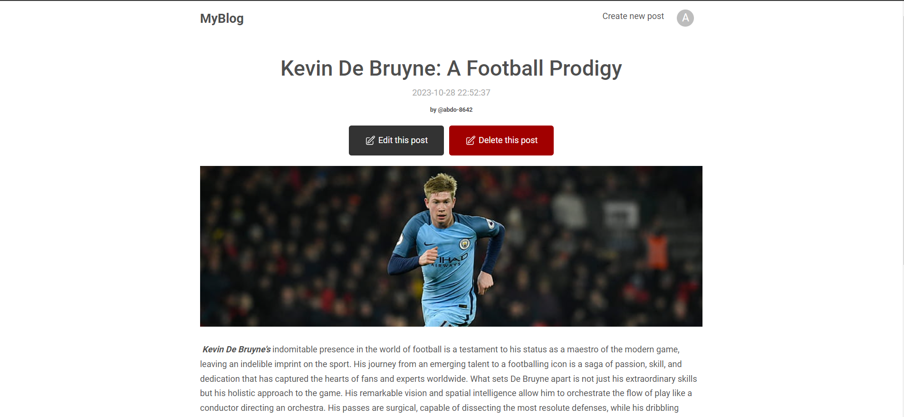
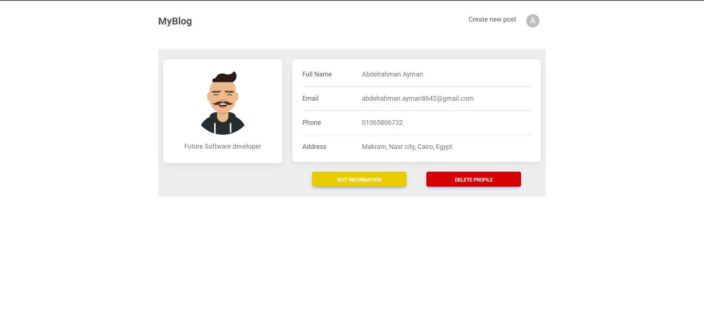
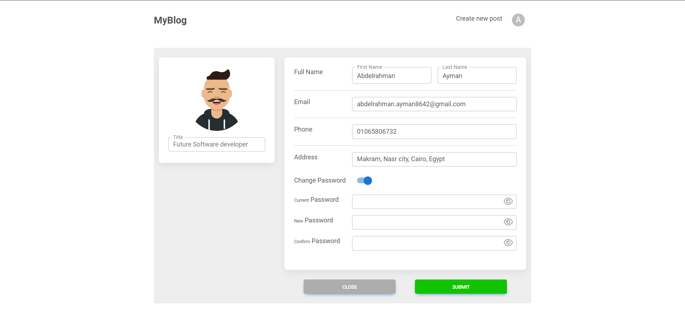
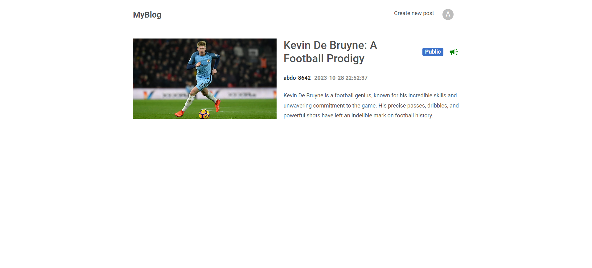
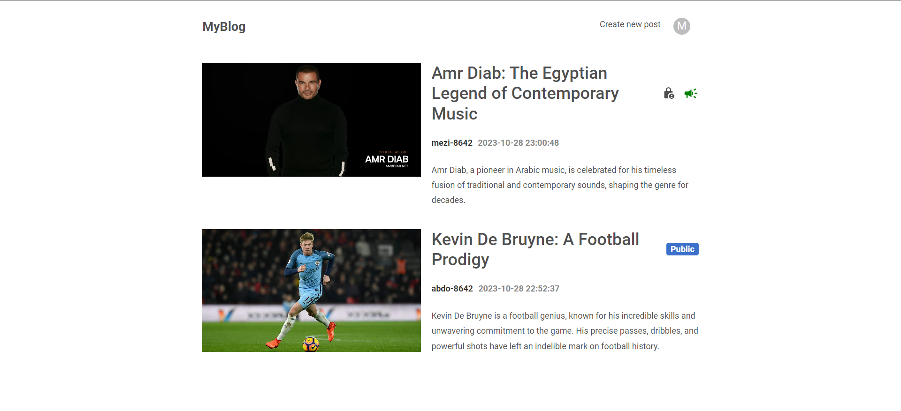

# A Full Stack MERN Blog

My MERN Stack Blog is a versatile and user-friendly full-stack web application designed to facilitate the creation and management of blog posts.

## Project Overview

### User Authentication and Security

- **User Registration**: The registration process is straightforward, ensuring that new users can quickly create an account with a unique email and password. This enhances user engagement and personalization.

- **User Login**: Registered users can securely log in with their credentials, ensuring the protection of their accounts and data.

- **Password Reset**: In the event of a forgotten password, the system offers a reliable password reset mechanism. A verification code is sent to the user's registered email address, allowing them to set a new password securely.

- **Data Encryption**: User data is stored securely in a MongoDB database with encryption. This level of security protects sensitive user information.

- **JWT-Based Authentication**: Authentication and authorization are implemented through JSON Web Tokens (JWT). This ensures that only authorized users can access protected routes and perform specific actions, significantly enhancing security.

### Blog Post Management

- **Create New Posts**: Users can create and publish new blog posts with ease. They have the option to provide a title, content, and optional tags to categorize their content. This makes content creation a straightforward process.

- **Edit and Update Posts**: The application allows users to edit and update their existing blog posts. This feature is essential for refining and updating content over time, improving the user experience.

- **Privacy Settings**: Users have control over the visibility of their blog posts. They can choose whether their posts are public, allowing them to be viewed by all visitors, or private, making them visible only to the author. This empowers users to manage the accessibility of their content.

### User Profile Customization

- **Profile Editing**: Users can customize their profile information, such as their name and email address, making their accounts more personalized and relevant.

- **Profile Picture**: To further personalize their profiles, users can upload a profile picture. This adds a visual touch to their accounts.

- **Account Deletion**: For users who decide to leave the platform, the option to delete their account is available. This ensures that user data is treated with respect and gives users control over their information.

## Technologies Used

The project makes effective use of the MERN (MongoDB, Express.js, React, Node.js) stack, showcasing the power and versatility of these technologies:

- **MongoDB**: As the database management system for storing user data and blog posts.

- **Express.js**: The framework used to build the backend server and define API routes, providing a robust and structured server-side architecture.

- **React**: Serving as the frontend framework, React ensures the creation of an interactive and dynamic user interface that enhances the user experience.

- **Node.js**: This runtime environment is utilized to execute the server-side logic and handle requests from the frontend, offering a smooth and efficient user experience.

- **JSON Web Tokens (JWT)**: The project leverages JWT for secure authentication, providing a reliable and efficient way to manage user access to protected resources and routes.

## Screenshots

_Description: The login page allows registered users to securely access their accounts._

_Description: New users can create an account by providing their email and password._

_Description: Users can have a mail with a reset code by providing an existing email address._

_Description: Users can have their password reseted when entering the reset code correctly._

_Description: Users can easily create new blog posts with titles, content, and optional tags._

\*Description: Users can manage their blog posts, including editing and updating existing posts.

_Description: The profile page enables users to see user's page._

_Description: The profile page enables users to customize their information._

_Description: What the first user sees in home screen._

_Description: What the second user sees in home screen._
